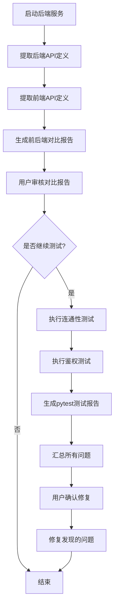

# 前后端接口自动化测试设计文档

**日期**: 2026-04-08
**版本**: 1.0
**目标**: 为stock_policy项目创建自动化测试脚本,验证前后端所有API接口的连通性和鉴权机制

---

## 1. 项目背景

### 1.1 当前系统架构
- **后端**: FastAPI (Python) - 22个API路由模块
- **前端**: Vue 3 + TypeScript - 22个API调用模块
- **通信**: RESTful API + Bearer Token鉴权

### 1.2 已识别问题
- 前后端接口定义可能不匹配
- 鉴权机制可能缺失或不一致
- 无自动化测试保障接口质量
- 手动测试耗时且容易遗漏

---

## 2. 设计目标

### 2.1 主要目标
1. **自动化验证所有API连通性** - 确保每个接口能正常响应
2. **前后端接口对比** - 验证前端调用的路径与后端实际路径匹配
3. **鉴权机制测试** - 验证PUBLIC/LOGIN_REQUIRED/ADMIN_REQUIRED分级正确
4. **生成专业测试报告** - 提供清晰的HTML报告供审核

### 2.2 非目标
- 业务逻辑深度测试(仅验证接口层面)
- 性能测试
- 并发压力测试

---

## 3. 技术方案

### 3.1 选定方案: Python pytest自动化测试

**选择理由**:
1. 与后端技术栈一致(Python/FastAPI)
2. pytest框架成熟,报告功能完善
3. 可直接解析FastAPI的OpenAPI schema
4. 测试脚本可重复使用,易于维护
5. 可集成到CI/CD流程

### 3.2 核心依赖
```
pytest>=7.0.0
pytest-html>=3.0.0
requests>=2.28.0
beautifulsoup4>=4.12.0  # 解析前端TypeScript文件
lxml>=4.9.0
```

---

## 4. 项目结构

```
backend/tests/
├── conftest.py                 # pytest配置和fixtures
├── test_runner.py              # 主测试执行器
├── api_extractor.py            # FastAPI Swagger解析器
├── frontend_parser.py          # 前端API解析器
├── interface_validator.py      # 前后端接口对比验证
├── auth_test_helper.py         # 鉴权测试辅助工具
├── config.py                   # 测试配置(BASE_URL等)
├── reports/                    # 测试报告目录
│   ├── interface_report.html   # 前后端接口对比报告
│   └── test_report.html        # pytest HTML测试报告
├── test_api/                   # 按模块分类的测试文件
│   ├── test_auth.py            # 认证接口测试
│   ├── test_strategy.py        # 策略接口测试
│   ├── test_red_line.py        # 红线接口测试
│   ├── test_trade.py           # 交易接口测试
│   ├── test_notification.py    # 通知接口测试
│   ├── test_warning.py         # 预警接口测试
│   ├── test_indicator.py       # 指标接口测试
│   ├── test_scheduler.py       # 调度器接口测试
│   ├── test_menu.py            # 菜单接口测试
│   ├── test_role.py            # 角色接口测试
│   ├── test_user.py            # 用户接口测试
│   ├── test_dict.py            # 字典接口测试
│   ├── test_config.py          # 配置接口测试
│   ├── test_monitor.py         # 监控接口测试
│   ├── test_ai_trade.py        # AI交易接口测试
│   ├── test_stock_analysis.py  # 股票分析接口测试
│   ├── test_factor_screen.py   # 因子筛选接口测试
│   ├── test_stock_pick.py      # 选股接口测试
│   ├── test_trade_log.py       # 交易日志接口测试
│   ├── test_position.py        # 持仓接口测试
│   └── test_condition_group.py # 条件组接口测试
└── requirements.txt            # 测试依赖
```

---

## 5. 核心组件设计

### 5.1 API Extractor (api_extractor.py)

**功能**: 从FastAPI Swagger/OpenAPI文档自动提取所有API信息

**核心类**:
```python
class APIExtractor:
    def __init__(self, base_url: str)
    
    def extract_all_apis(self) -> List[APIInfo]
        """提取所有API路由信息
        返回: [
            {
                path: "/api/v1/auth/login",
                method: "POST",
                parameters: {...},
                auth_required: "LOGIN_REQUIRED",
                tags: ["用户认证"]
            }
        ]
        """
    
    def get_auth_requirement(self, path: str, method: str) -> AuthLevel
        """判断接口需要的鉴权级别
        返回: PUBLIC | LOGIN_REQUIRED | ADMIN_REQUIRED
        """
```

**实现方式**:
1. 请求 `{base_url}/openapi.json`
2. 解析JSON中的paths字段
3. 检查每个operation的security字段判断鉴权级别
4. 提取parameters、tags等信息

### 5.2 Frontend Parser (frontend_parser.py)

**功能**: 解析前端API模块,提取前端定义的接口

**核心类**:
```python
class FrontendParser:
    def parse_frontend_api(self, file_path: str) -> List[FrontendAPIInfo]
        """解析frontend/src/api/*.ts文件
        提取: {
            function_name: "login",
            backend_path: "/v1/auth/login",
            method: "POST",
            params: [...]
        }
        """
    
    def extract_all_frontend_apis(self) -> Dict[str, List[FrontendAPIInfo]]
        """扫描frontend/src/api/目录下所有文件
        返回: {
            "auth.ts": [...],
            "strategy.ts": [...],
            ...
        }
        """
```

**实现方式**:
1. 使用正则表达式匹配TypeScript函数定义
2. 提取request.get/post/put/delete调用中的路径
3. 从JSDoc注释中提取函数用途信息

### 5.3 Interface Validator (interface_validator.py)

**功能**: 前后端接口对比验证

**核心类**:
```python
class InterfaceValidator:
    def compare_backend_frontend(self) -> ValidationResult
        """对比前后端接口定义
        检查项:
        1. 路径是否匹配(考虑baseURL差异)
        2. HTTP方法是否匹配
        3. 参数类型是否兼容
        4. 前端是否有调用未实现的后端接口
        5. 后端是否有未被前端调用的接口
        """
    
    def generate_comparison_report(self, result: ValidationResult) -> str
        """生成HTML对比报告"""
```

**匹配逻辑**:
- 前端路径 `/v1/auth/login` 与后端 `/api/v1/auth/login` 视为匹配(baseURL差异)
- HTTP方法必须完全匹配
- 参数数量和类型需兼容

### 5.4 Auth Test Helper (auth_test_helper.py)

**功能**: 鉴权测试辅助工具

**核心类**:
```python
class AuthTestHelper:
    def __init__(self, session: requests.Session)
    
    async def login_as_admin(self) -> str
        """获取管理员token"""
    
    async def login_as_user(self) -> str
        """获取普通用户token"""
    
    def test_public_endpoint(self, url: str) -> Response
        """测试公开接口(无需token)"""
    
    def test_auth_endpoint(self, url: str, token: str) -> Response
        """测试需要登录的接口"""
    
    def test_admin_endpoint(self, url: str, admin_token: str) -> Response
        """测试需要管理员的接口"""
```

**测试策略**:
- PUBLIC: 无token访问 → 期望200
- LOGIN_REQUIRED: 无token → 401, 有token → 200/403
- ADMIN_REQUIRED: 普通用户 → 403, 管理员 → 200

---

## 6. 测试用例设计

### 6.1 测试分类

每个API模块包含三类测试:

**1. 连通性测试**
- 验证接口存在(返回200/401/403/400等合理状态码)
- 验证响应格式为JSON
- 验证响应结构包含必要字段(code, message, data)

**2. 鉴权测试**
- PUBLIC接口: 无token可访问
- LOGIN_REQUIRED接口: 无token返回401
- ADMIN_REQUIRED接口: 普通用户返回403

**3. 参数验证测试**
- 必填参数缺失 → 400
- 参数类型错误 → 400

### 6.2 测试模板

每个test_*.py遵循统一模板:

```python
import pytest
from tests.auth_test_helper import AuthTestHelper
from tests.config import BASE_URL

class TestXXXAPI:
    """XXX模块接口测试"""
    
    @pytest.fixture
    def auth_helper(self):
        return AuthTestHelper()
    
    # ===== 连通性测试 =====
    def test_endpoint_xxx_exists(self):
        """验证接口存在"""
        resp = requests.get(f"{BASE_URL}/api/v1/xxx")
        assert resp.status_code in [200, 401, 403, 400]
    
    # ===== 鉴权测试 =====
    def test_xxx_requires_login(self, auth_helper):
        """验证需要登录"""
        resp = auth_helper.test_public_endpoint("/api/v1/xxx")
        assert resp.status_code == 401
    
    # ===== 参数验证测试 =====
    def test_xxx_missing_required_param(self, auth_helper, admin_token):
        """验证必填参数"""
        resp = requests.post(
            f"{BASE_URL}/api/v1/xxx",
            headers={"Authorization": f"Bearer {admin_token}"},
            json={}  # 缺少必填参数
        )
        assert resp.status_code == 400
```

### 6.3 覆盖范围

**需要测试的API模块**:
1. auth (认证) - 6个接口
2. strategy (策略) - 6个接口
3. red_line (红线) - 12个接口
4. trade (交易) - 8个接口
5. notification (通知) - 8个接口
6. warning (预警) - 5个接口
7. indicator (指标) - 6个接口
8. scheduler (调度器) - 5个接口
9. menu (菜单) - 4个接口
10. role (角色) - 5个接口
11. user (用户) - 5个接口
12. dict (字典) - 4个接口
13. config (配置) - 4个接口
14. monitor (监控) - 3个接口
15. ai_trade (AI交易) - 3个接口
16. stock_analysis (股票分析) - 4个接口
17. factor_screen (因子筛选) - 3个接口
18. stock_pick (选股) - 4个接口
19. trade_log (交易日志) - 4个接口
20. position (持仓) - 8个接口
21. condition_group (条件组) - 4个接口

**总计**: 约90-100个接口需要测试

---

## 7. 报告生成机制

### 7.1 前后端接口对比报告 (interface_report.html)

**内容结构**:
1. **统计摘要**
   - 后端接口总数
   - 前端API函数总数
   - 完全匹配数量
   - 路径不匹配数量
   - 前端缺少对应后端数量
   - 后端未被前端调用数量

2. **详细对比结果表格**
   - 后端路径 | 方法 | 前端函数 | 匹配状态 | 备注
   - 使用颜色标记: 绿色(matched), 红色(mismatch), 黄色(missing_frontend), 蓝色(missing_backend)

3. **鉴权要求对比表格**
   - 接口 | 后端鉴权要求 | 前端是否传Token | 状态

**生成时机**: 测试开始前,先生成对比报告供审核

### 7.2 pytest测试执行报告 (test_report.html)

**内容包含**:
- 测试统计: 通过/失败/跳过数量
- 执行时间
- 每个测试用例的详细结果
- 失败原因和错误堆栈
- 环境信息

**生成命令**:
```bash
pytest backend/tests/ \
    --html=backend/tests/reports/test_report.html \
    --self-contained-html \
    -v \
    --tb=short
```

---

## 8. 执行流程

### 8.1 主流程



### 8.2 详细步骤

**步骤1: 环境准备**
- 安装测试依赖: `pip install pytest pytest-html requests beautifulsoup4`
- 启动后端服务: `python backend/main.py` 或确保服务已运行
- 配置测试BASE_URL (默认: http://localhost:8030)

**步骤2: 生成对比报告**
- 运行: `python backend/tests/interface_validator.py`
- 输出: `backend/tests/reports/interface_report.html`
- 用户审核报告,确认是否继续

**步骤3: 执行pytest测试**
- 运行: `pytest backend/tests/test_api/ --html=reports/test_report.html -v`
- 测试所有接口的连通性和鉴权
- 输出: `backend/tests/reports/test_report.html`

**步骤4: 问题汇总与修复**
- 从两个报告中提取所有问题
- 生成问题清单供用户确认
- 用户确认后执行修复

---

## 9. 测试数据准备

### 9.1 测试账号

需要准备以下测试账号:

**管理员账号**:
- username: admin
- password: admin123 (或从配置读取)
- role: admin

**普通用户账号**:
- username: test_user
- password: test123
- role: user

**创建方式**:
- 如果数据库已有账号,直接使用
- 如果没有,在conftest.py中自动创建

### 9.2 测试数据

某些接口需要测试数据(如策略、红线规则等):
- 优先使用查询类接口(GET)测试
- 对于创建类接口(POST),测试后清理数据
- 使用临时数据标识,避免影响生产数据

---

## 10. 预期产出

### 10.1 文件产出
1. `backend/tests/` 目录下的所有测试脚本
2. `backend/tests/reports/interface_report.html` - 接口对比报告
3. `backend/tests/reports/test_report.html` - pytest测试报告
4. `backend/tests/requirements.txt` - 测试依赖清单
5. `backend/tests/README.md` - 测试使用文档

### 10.2 测试覆盖
- 22个API模块全覆盖
- 约90-100个接口的连通性验证
- 鉴权机制全验证
- 前后端路径对比全验证

### 10.3 问题发现
预期发现的问题类型:
- 路径不匹配(前后端路径差异)
- 鉴权缺失(应鉴权但实际未鉴权)
- 权限级别错误(应为ADMIN但实际为LOGIN)
- 参数验证缺失
- 前端调用了不存在接口

---

## 11. 使用说明

### 11.1 快速开始

```bash
# 1. 安装测试依赖
cd backend/tests
pip install -r requirements.txt

# 2. 启动后端服务(如果未运行)
cd backend
python main.py

# 3. 运行接口对比
cd backend/tests
python interface_validator.py
# 打开 reports/interface_report.html 查看

# 4. 运行pytest测试
pytest test_api/ --html=reports/test_report.html -v
# 打开 reports/test_report.html 查看

# 5. 查看所有报告并确认修复
```

### 11.2 配置修改

如需修改测试配置,编辑 `backend/tests/config.py`:
```python
BASE_URL = "http://localhost:8030"  # 后端服务地址
ADMIN_USERNAME = "admin"            # 管理员账号
ADMIN_PASSWORD = "admin123"         # 管理员密码
USER_USERNAME = "test_user"         # 普通用户账号
USER_PASSWORD = "test123"           # 普通用户密码
```

---

## 12. 后续扩展

### 12.1 可扩展方向
1. **集成到CI/CD** - 在每次提交时自动运行测试
2. **性能测试** - 使用locust进行接口性能测试
3. **业务逻辑测试** - 添加更深入的业务验证
4. **Mock数据** - 使用pytest-mock模拟外部依赖

### 12.2 维护建议
- 每次新增API接口时,同步添加测试文件
- 定期运行测试,确保接口质量
- 将测试报告纳入版本控制

---

## 13. 风险与应对

### 13.1 风险点
1. **测试账号不存在** - conftest.py会自动创建测试账号
2. **后端服务未启动** - 测试脚本会检测并提示
3. **数据库连接失败** - 需确保数据库服务运行
4. **测试污染数据** - 使用临时数据并在测试后清理

### 13.2 应对策略
- 提供详细的错误提示和使用文档
- 测试脚本包含环境检测功能
- 使用pytest的fixture机制自动清理测试数据

---

## 14. 总结

本设计文档定义了一套完整的自动化接口测试方案,能够:
1. 自动提取前后端API定义并对比
2. 验证所有接口的连通性
3. 验证鉴权机制的完整性
4. 生成专业的HTML测试报告
5. 支持用户审核后修复问题

方案使用Python pytest框架,与后端技术栈一致,测试脚本可重复使用,易于维护和扩展。